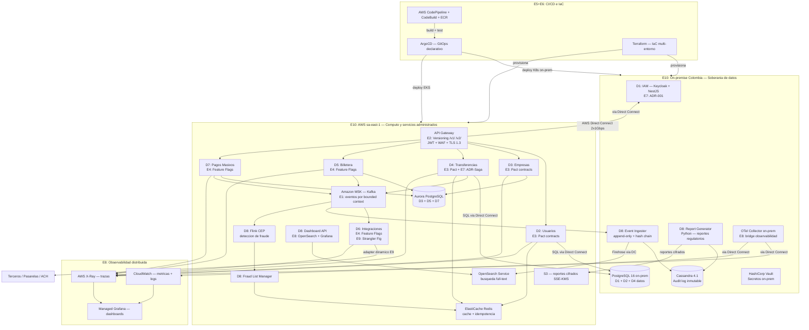

# Sección 5 — Estrategias para facilitar la evolución de la arquitectura

> **Trazabilidad:** Estrategias → RNF-05 (Extensibilidad), RNF-10 (Mantenibilidad), RNF-09 (Observabilidad) → Dominios D1–D8

---

## Introducción

Una arquitectura evolutiva es aquella que **soporta cambio guiado e incremental como primera clase** (Ford, Parsons & Kua, *Building Evolutionary Architectures*, O'Reilly, 2017). Las estrategias descritas a continuación permiten que el sistema de la Empresa X se adapte a nuevos bancos filiales, pasarelas de pago, regulaciones y volúmenes de usuarios sin incurrir en rediseños completos. Cada estrategia se vincula a los RNF identificados en la Sección 2 y se materializa en los componentes de la Sección 3 y el stack tecnológico de la Sección 4.

---

## Estrategias identificadas

### E1 — Diseño por Bounded Contexts (DDD)

**Qué es:** Cada dominio (D1–D8) tiene responsabilidad única, modelo de datos propio y base de datos independiente (*Database per Service*).

**Por qué facilita la evolución:** Se puede modificar, versionar o reemplazar un dominio sin impacto en los demás. Ejemplo: migrar D6 (Integraciones) a un nuevo proveedor de pasarela no afecta D4 (Transferencias).

**Dónde aplica:** Todos los dominios (D1–D8).

---

### E2 — Versionado de APIs

**Qué es:** Cada microservicio expone versiones explícitas de su API (`/v1/`, `/v2/`). Los contratos se documentan con OpenAPI 3.x.

**Por qué facilita la evolución:** Permite introducir cambios incompatibles sin romper consumidores existentes. Los clientes migran a nuevas versiones de forma progresiva.

**Dónde aplica:** API Gateway → todos los microservicios. Crítico en D6 (Integraciones) y D4 (Transferencias).

---

### E3 — Consumer-Driven Contract Testing (Pact)

**Qué es:** Los consumidores de una API definen los contratos que el proveedor debe cumplir. Se verifican automáticamente en el pipeline CI/CD.

**Por qué facilita la evolución:** Detecta rupturas de contrato antes de llegar a producción. Permite refactorizar microservicios con confianza.

**Dónde aplica:** Interfaces entre D4↔D6, D5↔D6, D7↔D6 y D2↔Bancos filiales.

---

### E4 — Feature Flags

**Qué es:** Activación/desactivación de funcionalidades en tiempo de ejecución sin redespliegue (ej. LaunchDarkly, OpenFeature).

**Por qué facilita la evolución:** Permite publicar código en producción desactivado, hacer canary releases y revertir funcionalidades sin rollback de despliegue. Especialmente útil al integrar nuevos terceros (D6).

**Dónde aplica:** D6 (activar nuevo tercero/pasarela), D7 (habilitar nuevas ventanas de pago), D5 (nuevas funcionalidades de billetera).

---

### E5 — CI/CD con pipelines por microservicio

**Qué es:** Cada dominio tiene su propio pipeline independiente (build → test → contract test → deploy). Stack CI/CD: **AWS CodePipeline** (orquestación de stages con aprobaciones manuales), **AWS CodeBuild** (build y test de imágenes de contenedores) y **Amazon ECR** (registro de imágenes). El despliegue en Kubernetes se realiza de forma declarativa mediante **ArgoCD** (GitOps), que sincroniza los manifests de Helm/Kustomize desde el repositorio de infraestructura.

**Por qué facilita la evolución:** Los dominios se despliegan de forma independiente. Un equipo puede entregar D3 sin esperar a D7. Reduce el acoplamiento de despliegue. ArgoCD garantiza que el estado del cluster siempre refleje lo declarado en Git, habilitando rollbacks instantáneos.

**Dónde aplica:** Todos los dominios (D1–D8) + infraestructura (K8s manifests vía GitOps/ArgoCD). Los servicios on-premise (D1, D8 Event Ingester, D8 Report Generator) se despliegan con ArgoCD apuntando al cluster K8s on-premise de Colombia.

---

### E6 — Infrastructure as Code (IaC)

**Qué es:** Toda la infraestructura (EKS, MSK, Aurora, Redis, K8s on-premise, Cassandra, Vault) definida como código versionado. Stack: **Terraform** (AWS provider + Kubernetes provider + Vault provider, state remoto en S3 + DynamoDB locking) + **Helm charts** para la definición de aplicaciones en Kubernetes.

**Por qué facilita la evolución:** Los entornos (dev, staging, prod) son reproducibles y auditables. Escalar o replicar el sistema en una nueva región es un cambio de configuración, no un proceso manual. Terraform gestiona tanto la infraestructura en AWS como el aprovisionamiento del cluster on-premise de Colombia desde un solo repositorio.

**Dónde aplica:** Infraestructura completa del sistema: AWS (`sa-east-1`) y datacenter on-premise (Colombia).

---

### E7 — Architecture Decision Records (ADR)

**Qué es:** Documento ligero que registra cada decisión arquitectónica significativa: contexto, decisión, consecuencias y alternativas descartadas.

**Por qué facilita la evolución:** Preserva el razonamiento detrás de cada decisión. Al introducir cambios futuros, el equipo sabe qué restricciones motivaron la arquitectura actual y puede evaluarlas de nuevo.

**Dónde aplica:** Repositorio central del proyecto. Ejemplos: ADR-001 (Modelo híbrido on-premise + AWS — Sección 4), ADR-002 (Kafka sobre RabbitMQ), ADR-003 (Saga coreografiada sobre 2PC), ADR-004 (Adapter dinámico en D6).

---

### E8 — Observabilidad distribuida (OpenTelemetry)

**Qué es:** Instrumentación estandarizada de trazas, métricas y logs en todos los microservicios mediante **OpenTelemetry SDK**. El stack de visualización y análisis es:

- **Trazas distribuidas:** AWS X-Ray (instrumentado vía OpenTelemetry SDK); genera Service Map para identificar latencia entre microservicios.
- **Métricas y dashboards:** Amazon CloudWatch (recolección nativa) + Amazon Managed Grafana (dashboards operacionales).
- **Logs centralizados:** Amazon CloudWatch Logs → Amazon Kinesis Data Firehose → Amazon OpenSearch Service (búsqueda full-text del audit log).
- **Bridge on-premise → AWS:** OpenTelemetry Collector desplegado en el cluster K8s on-premise de Colombia exporta métricas, logs y trazas de D1 y D8 a CloudWatch, X-Ray y Amazon Managed Prometheus (AMP) vía Direct Connect, consolidando la observabilidad en los mismos dashboards.

**Por qué facilita la evolución:** Permite identificar cuellos de botella antes de que sean problemas en producción. Al agregar un nuevo dominio, la instrumentación es automática si sigue el estándar OpenTelemetry. La consolidación on-premise + AWS en un solo stack de observabilidad reduce la carga operacional.

**Dónde aplica:** Todos los dominios (D1–D8) + Amazon MSK + API Gateway + cluster K8s on-premise.

---

### E9 — Patrón Strangler Fig (para migraciones futuras)

**Qué es:** Cuando un dominio necesita ser reemplazado, se introduce el nuevo servicio en paralelo y se migra el tráfico gradualmente usando el API Gateway como punto de control.

**Por qué facilita la evolución:** Elimina las migraciones "big bang". El sistema sigue operando mientras se migra. Alineado con el requisito de disponibilidad 24/7 (RNF-01).

**Dónde aplica:** Cualquier dominio que requiera reemplazo futuro. Especialmente relevante para D2 (sincronización con bancos) y D6 (integraciones).

---

### E10 — Modelo híbrido y soberanía de datos

**Qué es:** El sistema se despliega en un **modelo híbrido** (datacenter on-premise en Colombia + AWS `sa-east-1`) conectado mediante **AWS Direct Connect** dedicado (2× 1 Gbps por rutas físicas distintas, ~15–25 ms de latencia). Los datos regulados (PII de ~25M usuarios, transacciones financieras, credenciales de autenticación, audit log inmutable) residen exclusivamente en territorio colombiano. Los servicios de cómputo y datos de menor sensibilidad regulatoria operan en AWS.

| Ubicación | Componentes | Justificación |
|---|---|---|
| **On-premise Colombia** | D1 (Keycloak + NestJS), D8 Event Ingester, D8 Report Generator, PostgreSQL (D1, D2, D4), Cassandra (D8), HashiCorp Vault, K8s 1.29 | Cumplimiento de la Circular Externa 007/2018 de la Superfinanciera: datos regulados no salen del territorio nacional |
| **AWS `sa-east-1`** | D2–D7 services (EKS), D8 Flink + Dashboard API + Fraud List Manager, Aurora PostgreSQL (D3, D5, D7), MSK, ElastiCache Redis, OpenSearch, S3, CloudFront, observabilidad | Servicios administrados, escalado automático, datos efímeros u operacionales |

**Por qué facilita la evolución:** Permite incorporar nuevos servicios administrados de AWS (ej. nueva base de datos, nuevo motor de ML para detección de fraude) sin impactar la soberanía de datos. Si la regulación colombiana cambia en el futuro (ej. se habilita hosting en AWS Colombia), la migración es progresiva: se mueven servicios on-premise a AWS dominio por dominio sin afectar al resto (alineado con E9 — Strangler Fig). La latencia adicional de Direct Connect (~15–25 ms) se mitiga con caché Redis en AWS (proxy de saldo TTL corto para D2, listas antifraude TTL 60 s para D4).

**Dónde aplica:** Infraestructura completa. Documentado en ADR-001 (Sección 4).

---

## Diagrama actualizado — Estrategias de evolución aplicadas

---

## Pendientes

- [ ] Confirmar si el equipo va a implementar alguna de estas estrategias en un prototipo o si es solo diseño
- [ ] Revisar con el equipo si hay estrategias adicionales identificadas en clase que deban incluirse
